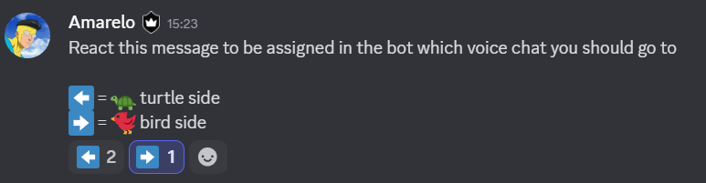

Voice Chat Splitter

Discord bot that registers a command `/vcsplit` on your configured guild and can split/join voice members into certain channels. Made for use in a raid environment

1. Install node and npm and git bash from the following links:
    * get git bash: https://git-scm.com/downloads
    * get nodejs: https://nodejs.org/en

2. Clone this repo with your git bash somewhere you will remember, use: git clone https://github.com/Fostecks/VCSplit.git

3. Inside the new folder the git clone created run, npm install

4. Create a config.json file on project's root with the following template: {
    "TOKEN": "xxxx.xxxx.xxxx",
    "BOT_CLIENT_ID": "xxxxxxxxxxxxx",
    "DISCORD_GUILD": "xxxxxxxxxxxxx",

    "CHANNEL_ID": "xxxxxxxxxxxxx",
    "SPLITTER_MESSAGE_ID": "xxxxxxxxxxxxx",
    "LEFT_VC": "xxxxxxxxxxxxx",
    "RIGHT_VC": "xxxxxxxxxxxxx",
    "COMBINED_VC": "xxxxxxxxxxxxx"
}

5. Ask repo owner to add the bot on your server and give you a token @fostecks

6. Fill out the config.json file with the ids, you need 3 voice chats one for the base voice chat and one for each split side, create a channel to have only one support message like this:

The reactions has to be :left_arrow: and :right_arrow:, To get all the IDs you need for the config.json file you just right click the vc or the message channel or the bot or even the server for the DISCORD_GUILD and click on the option Copy ID on the bottom of the select

7. After you have all this done just run node . on project's root and if no errors are thrown in the bash you should be good, just run /vcsplit on your server and you will be able to split or join the groups with one click!